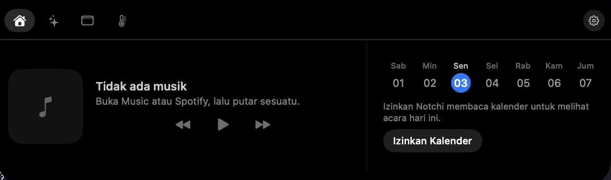
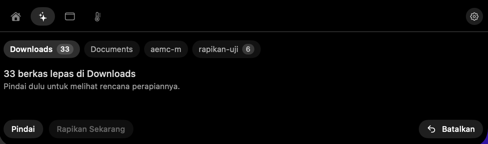
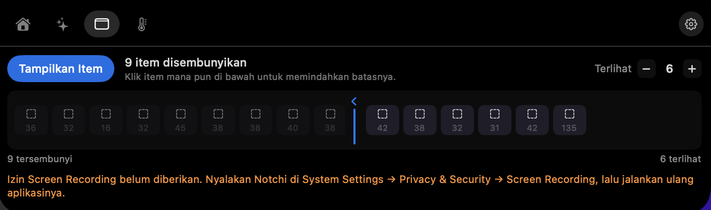
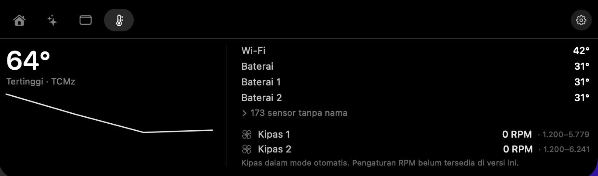
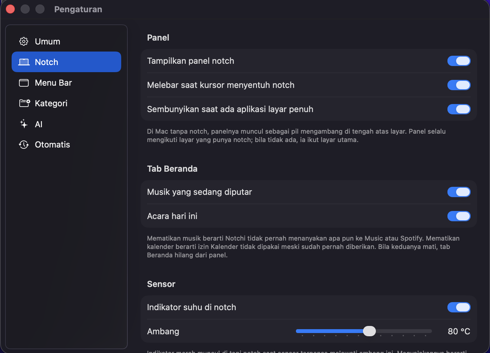

# Notchi

**Notch MacBook Anda jadi pusat kendali.** Satu panel yang turun dari notch —
diintip saat kursor lewat, dibuka saat diklik atau ditekan `⌥⌘N` — berisi
hal-hal yang biasanya tersebar di banyak aplikasi kecil: musik yang sedang
diputar, acara hari ini, perapian folder yang berantakan, penataan menu bar,
dan pemantauan suhu.

Di Mac tanpa notch, panelnya muncul sebagai pil mengambang di tengah atas layar.
Perilakunya sama persis.

> **Versi 0.9.0 — pra-rilis.** Bisa dipakai sehari-hari, tapi belum semua yang
> direncanakan masuk. Yang belum ada disebutkan apa adanya di bawah.


---

## Tampilan

Panel punya tiga keadaan: **diam** (terlihat seperti notch asli, hanya indikator
tipis bila ada yang perlu perhatian), **intip** (melebar saat kursor masuk area
notch), dan **terbuka** (panel penuh dengan tab).

### Beranda — musik & acara hari ini



### Rapikan — perapian folder

Pindai folder, tinjau rencananya, rapikan, dan batalkan bila tidak cocok.
Tidak ada berkas yang dipindahkan sebelum Anda melihat rencananya.



### Menu Bar — sembunyikan & tata ulang

Menyembunyikan item menu bar lewat pemisah, dan mengatur berapa yang tetap
terlihat. Menyembunyikan item **tidak butuh izin apa pun**.



### Sensor — suhu & kipas

Suhu tiap sensor dengan sparkline 60 detik, dan RPM tiap kipas beserta rentang
firmware-nya.



### Pengaturan



---

## Pemasangan

**Syarat:** macOS 26 atau lebih baru. Apple Silicon dan Intel.

Pemakai macOS 14 (Sonoma) dan 15 (Sequoia) berhenti di
[0.9.3](https://github.com/epamemo/notchi/releases/tag/v0.9.3), yang tetap
tersedia dan tetap berfungsi.

1. Unduh `Notchi.dmg` dari [halaman Releases](https://github.com/epamemo/notchi/releases).
2. Buka .dmg, seret **Notchi.app** ke folder Applications.
3. Buka Notchi sekali. macOS akan menolaknya — ini yang diharapkan, lanjutkan
   ke langkah 4.
4. Buka **System Settings → Privacy & Security**, gulir ke bawah sampai
   menemukan keterangan bahwa Notchi diblokir, tekan **Open Anyway**, lalu
   masukkan kata sandi admin Anda.

Hanya sekali. Sesudah itu Notchi dibuka seperti aplikasi lain.

### Alternatif lewat Terminal

Bila Anda lebih suka satu perintah daripada membuka System Settings, jalankan
ini **setelah** menyeret Notchi ke Applications dan **sebelum** membukanya:

```bash
xattr -rd com.apple.quarantine /Applications/Notchi.app
```

Sesudah itu Notchi langsung terbuka — tanpa Gatekeeper, tanpa System Settings.

**Apa yang sebenarnya terjadi.** macOS menempelkan penanda
`com.apple.quarantine` pada apa pun yang diunduh dari internet, dan Gatekeeper
memakai penanda itu untuk memutuskan perlu-tidaknya memeriksa aplikasi saat
pertama dibuka. Perintah di atas menghapus penandanya, jadi pemeriksaannya
dilewati. Ini mekanisme yang sama persis dengan `--no-quarantine` milik Homebrew.

**Yang Anda lepaskan, dan ini sengaja disebut.** Jalur *Open Anyway*
memperlihatkan **apa** yang sedang Anda izinkan — nama aplikasinya tertulis, di
antarmuka Apple sendiri. Perintah Terminal menyetujuinya tanpa Anda melihat apa
pun. Untuk Notchi itu pertukaran yang wajar bila Anda memang berniat
memasangnya; yang perlu diwaspadai adalah **polanya**, karena bentuk perintah
yang sama berlaku untuk aplikasi apa pun dan beredar dengan nama yang tinggal
diganti. Jangan menjalankannya untuk sesuatu yang asalnya tidak Anda percayai.

> `sudo` tidak diperlukan. Aplikasi yang Anda seret sendiri ke `/Applications`
> dimiliki akun Anda; banyak panduan menuliskannya dengan `sudo`, dan itu
> memberi hak penuh yang tidak dipakai perintah ini.

**Kenapa serepot ini.** Notchi ditandatangani dengan sertifikat Apple, tapi
belum dinotarisasi — notarization menuntut akun Apple Developer berbayar
($99/tahun) yang belum diambil. Sejak macOS Sequoia (15), Apple
[menghapus jalan pintas Control-klik → Buka](https://appleinsider.com/articles/24/08/06/apple-removes-control-click-option-for-skipping-gatekeeper)
untuk aplikasi semacam ini, sehingga System Settings jadi satu-satunya jalan.

### Setelah memperbarui Notchi

**Tidak ada yang perlu diulang.** Unduh `.dmg` baru, seret ke Applications,
timpa yang lama.

Versi sebelum 0.9.2 ditandatangani ad-hoc, dan itu membuat macOS memperlakukan
tiap pembaruan sebagai aplikasi yang berbeda — izin privasi disetel ulang setiap
kali. **Itu sudah tidak berlaku.** Sejak identitas penandatanganannya tetap:

- Langkah *Open Anyway* cukup sekali, tidak diulang tiap pembaruan.
- Izin yang pernah Anda berikan **bertahan** — Kalender, Automation, Screen
  Recording, Accessibility, dan Lokasi.
- Setelan, kategori, dan daftar folder tidak pernah ikut hilang.

### Penyiapan awal

Notchi hidup di latar sebagai agen menu bar — tidak ada ikon Dock. Setelah
dibuka pertama kali:

1. Panel muncul di notch. Tekan `⌥⌘N` atau klik notch untuk membukanya.
2. Buka **Pengaturan** lewat ikon gerigi di kanan atas panel.
3. Di **Pengaturan → Kategori**, pilih satu set kategori (Umum, Pelajar &
   Mahasiswa, atau Freelancer & Kreatif) supaya perapian tahu harus menaruh
   berkas ke mana.
4. Di **Pengaturan → Notch**, matikan bagian yang tidak Anda pakai. Bila musik
   dan kalender dua-duanya dimatikan, tab Beranda ikut hilang dari panel.
5. Di tab **Rapikan**, tambahkan folder yang ingin dirapikan, lalu tekan
   *Pindai* — bukan *Rapikan Sekarang*. Lihat dulu rencananya.

Semua perapian bisa dibatalkan lewat tombol *Batalkan*.

---

## Izin

Notchi meminta izin **hanya saat fiturnya dipakai**, tidak pernah saat
peluncuran. Semuanya bisa ditolak; yang mati hanya bagian itu.

| Izin | Untuk apa | Kapan diminta |
|---|---|---|
| Akses folder | Membaca dan merapikan folder pilihan Anda | Saat folder ditambahkan |
| Automation (Music/Spotify) | Membaca lagu yang diputar dan meneruskan tombol kendali | Saat tab Beranda dibuka dengan pemutar berjalan |
| Kalender | Menampilkan acara hari ini | Saat Anda menekan *Izinkan Kalender* |
| Screen Recording | Menggambar ikon item menu bar yang tersembunyi (Ice Bar) | Saat Anda menyalakan Ice Bar |
| Accessibility | Menggeser item menu bar milik aplikasi lain | Saat Anda menekan *Izinkan Susun Ulang…* |

**Yang tidak butuh izin sama sekali:** panel notch dan hotkey `⌥⌘N`, membaca
suhu dan RPM kipas, membaca daftar item menu bar, dan menyembunyikan item lewat
pemisah.

> **Catatan Screen Recording.** macOS baru menerapkan izin ini setelah aplikasi
> dijalankan ulang. Beri izinnya di System Settings, **keluar dari Notchi, lalu
> buka lagi** — kalau tidak, Ice Bar tetap melaporkan izin belum ada meski
> daftarnya sudah tercentang.

Notchi tidak menyentuh jaringan kecuali Anda menyalakan pemeriksaan versi baru
di **Pengaturan → Umum**. Tidak ada telemetri, tidak ada akun.

---

## Yang belum ada di 0.9.0

Disebut di sini supaya tidak ada yang memasang lalu mencarinya:

- **Mengatur RPM kipas belum bisa.** Tab Sensor memantau suhu dan RPM, tapi
  belum ada cara mengunci kipas di kecepatan tertentu. Mengubah putaran kipas
  hanya bisa dilakukan proses berhak istimewa, dan pemasangannya butuh
  sertifikat Apple Developer berbayar supaya bisa satu klik. Ditunda ke versi
  berikutnya, bukan dibuang.
- **Kurva kipas berbasis sensor** (kipas mengikuti satu sensor) belum ada.
- **Nama sensor di Apple Silicon sebagian masih mentah** (`Tg05`, `TCMz`, …).
  Peta nama yang beredar di internet terbukti salah di mesin uji — satu kunci
  yang katanya GPU membaca 9 °C saat mesin sibuk. Nama baru dipasang setelah
  ada bukti pembandingan sungguhan, bukan tebakan.
- **Belum dinotarisasi**, karena itu ada langkah klik kanan → Buka di atas.

## Diketahui bermasalah

- Modul menu bar bergantung pada perilaku macOS yang tidak dijamin stabil antar
  versi. Bila setelah pembaruan macOS item tidak lagi terbaca, laporkan lewat
  Issues.
- Susun ulang item menu bar butuh Accessibility dan tidak berhasil pada semua
  aplikasi — sebagian item menolak digeser.

---

## Pembaruan

Notchi bisa memeriksa versi baru sekali sehari lewat halaman Releases ini.
**Mati secara bawaan** — nyalakan di **Pengaturan → Umum**. Pemeriksaannya hanya
membaca; tidak ada yang terpasang sendiri. Unduhan versi baru tetap Anda yang
memutuskan.

## Mencopot

Seret **Notchi.app** ke Trash. Setelan tersimpan di `~/Library/Preferences` dan
`~/Library/Application Support/Notchi` — hapus kalau ingin bersih total.

Folder yang sudah dirapikan **tidak berubah** saat aplikasi dicopot; berkasnya
tetap di tempat barunya.

---

## Umpan balik

Laporan galat dan usulan lewat [Issues](https://github.com/epamemo/notchi/issues).
Sertakan versi macOS, model Mac, dan versi Notchi (ada di Pengaturan → Umum).

## Lisensi

Notchi adalah **freeware** — gratis dipakai, termasuk untuk keperluan komersial.
Kode sumbernya tertutup dan tidak dipublikasikan. Repositori ini hanya berisi
halaman unduhan, dokumentasi, dan pelacak isu.

Notchi ditulis dari nol. Ice dan boring.notch dipakai sebagai **referensi
perilaku** saja — tidak ada baris kode dari keduanya yang disalin, sehingga
Notchi tidak terikat GPL. Lapisan SMC-nya (pembacaan suhu dan kipas) ditulis
sendiri lewat IOKit.

© 2026 Epafraditus Memoriano
